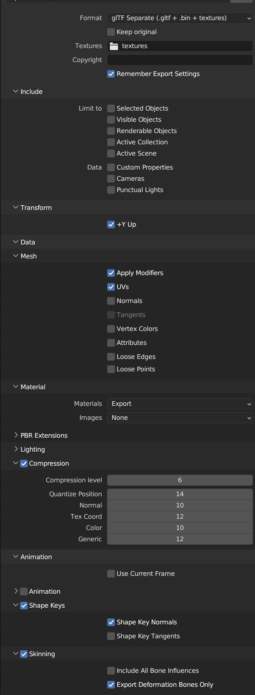
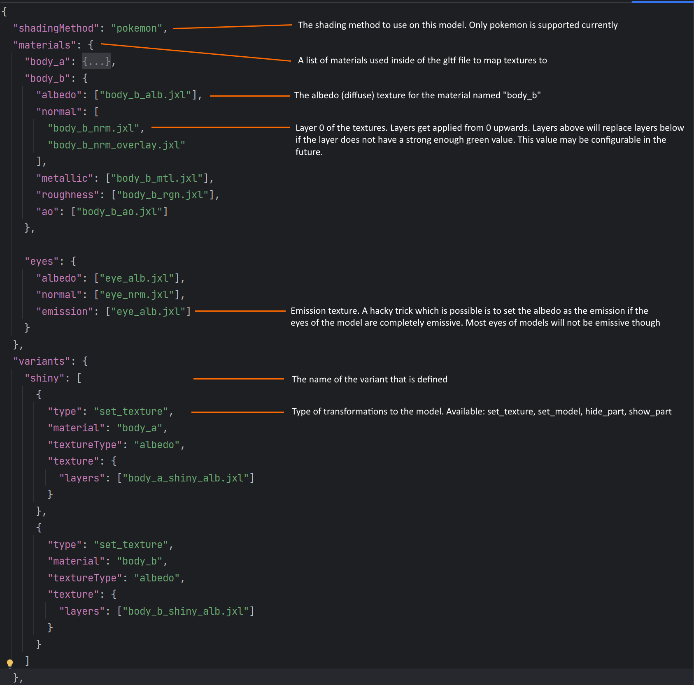

# PokeCraft Asset Repositories
part of our compression system in PokeCraft.

## How to build the repositories
On windows: `gradlew run` 
On linux:  `./gradlew run`

## FAQ
 - ### Where do the repositories get exported to?
Check for a folder called `assets`. This folder should contain the repositories

- ###  How do I add a new repository?
Go to line 20 of `Main.java` and duplicate the line then point the directory to your new repo

## The Model Format (Subject to Change)

### the 3 core parts:
- Highly compressed GLTF files
- The *Magic*™ texture format
- The model.config.json file

Let's talk about the model format first.  
Settings used to generate the model file: 
  
I have determined these are the best settings possible for exporting a model without any noticeable drop in quality of the mesh, bones, or texture mapping. 
It is standard practice to have the gltf file named `model.gltf` for any models you create.  
Now that you have gotten the easy step out of the way, lets talk about textures... 
Before we start with textures, almost always the texture will be mirrored (normals will look mirrored but won't be so be careful). We can save space here by only saving the left half of the image. I use paint.net, so I change the canvas size to 512x1024 (or 256x512 if the image was 512x512) to achieve this.  
For these next two optimizations you will need to clone or download (most users will just download) the [RKS Repository](https://github.com/The-PokeCraft-Mod/RKS) and use the `Silvally` tool in there to generate emission textures and to create overlay textures for close to mirrored images. These steps are used to grab more information that was hidden and to save up to 200kb per texture. 
The final step of saving space with these textures is to convert the `png` files you have into `jxl`. I recommend paint.net for this as [the plugin I use](https://github.com/0xC0000054/pdn-jpegxl) for it allows you to set the quality of the texture export. I uncheck the `lossless` box and set the `quality` to `80` for most textures. If a texture is simple, you will most likely get away with a value of `60` or if you are very lucky a value as low as `20`.  
To configure the `model.config.json` file, I recommend looking at other models for examples as this format may change in the future. For now I wrote this nice documentation what it currently can do.

